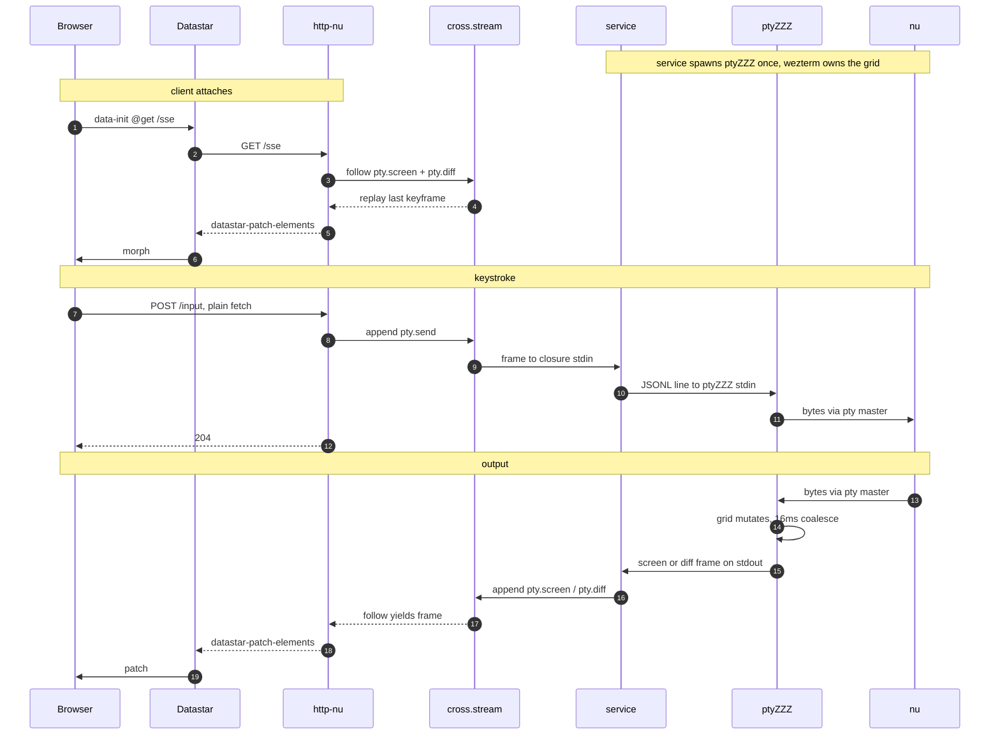

<h1>
<p align="center">
  ptyZZZ
</h1>
  <p align="center">
    A terminal as a unix pipe: keystrokes go in as JSONL, and the screen comes out as HTML. You can then pipe that directly to a web page.
    <br />
    <a href="#install">Install</a>
    ·
    <a href="./PROTOCOL.md">Protocol</a>
    ·
    <a href="https://discord.com/invite/YNbScHBHrh">Discord</a>
  </p>
</p>

<p align="center">
  <a href="https://github.com/cablehead/ptyZZZ/releases">
    
  </a>
  <a href="https://discord.com/invite/YNbScHBHrh">
    
  </a>
</p>

https://github.com/user-attachments/assets/b0d48f3b-2adc-4dd4-99e3-cf04bf8e5265

---

ptyZZZ runs a shell in a pty and emulates the terminal on the server, with
[wezterm-term](https://github.com/wezterm/wezterm). Keystrokes go in as JSONL
on stdin. The screen, scrollback included, comes out as JSONL frames of
rendered HTML.

```
JSONL commands ──> ptyZZZ ──> JSONL screen frames
   (stdin)        pty + grid       (stdout)
```

The browser gets finished HTML, so it needs no
[xterm.js](https://xtermjs.org) or
[ghostty-web](https://github.com/coder/ghostty-web) and holds no terminal
state. One terminal can feed any number of viewers.

## Try it

```bash
eget cablehead/ptyZZZ    # or see Install below
printf '{"t":"input","b":"ls\\n"}\n' | ptyZZZ run -- nu
```

That types `ls` into a fresh `nu` and prints screen frames until stdin closes.

The browser view needs [http-nu](https://github.com/cablehead/http-nu) and a
`nu` on PATH. `serve.nu` spawns `target/release/ptyZZZ` if you have a source
build, otherwise `ptyZZZ` on PATH:

```bash
http-nu --dev --datastar --services --store ./store 127.0.0.1:5111 serve.nu
```

Open http://127.0.0.1:5111 and type into the page.

The bigger demo is [examples/cube](examples/cube): six live terminals on a
spinning CSS cube, all on one SSE connection. The front face is an interactive
shell. [examples/panes](examples/panes) is a niri-style multiplexer: open,
split, and close panes at runtime. [examples/through](examples/through) is one
full-screen pane that yaws to show the headless wezterm behind it, projecting
HTML onto the page.

## Why the emulator lives on the server

The usual web terminal puts the emulator in the browser (xterm.js, now
ghostty-web) and proxies raw pty bytes to it. That works until the tab closes.
To survive disconnects, the server needs a session of its own, and the session
has two hard jobs:

- Answer terminal queries (where is the cursor?) while no browser is attached.
  Programs block until something replies.
- Give a reconnecting browser the current screen. Replaying saved bytes fails:
  a ring buffer can cut in mid-escape-sequence, and the screen comes up
  scrambled.

Both jobs take a terminal emulator. tmux settled this long ago: its server
parses everything into a grid and repaints the grid on attach. Clients never
see raw shell output.

So the proxy design runs two full emulators, and wherever their parsers
disagree the screen corrupts. ptyZZZ keeps one, next to the pty, and the
browser just renders HTML.

[stacks2099](https://github.com/cablehead/stacks2099) has run this shape for a
while; corrupted sessions stopped when the client emulator went away. Its
[journey.md](https://github.com/cablehead/stacks2099/blob/main/journey.md)
covers the road here. ptyZZZ is the same design as a standalone process, with
row-level damage tracking and diffs added to the renderer.

## Install

### [eget](https://github.com/zyedidia/eget)

```bash
eget cablehead/ptyZZZ
```

### Homebrew (macOS)

```bash
# Homebrew now asks you to trust a third-party tap before installing from it
brew trust --formula cablehead/tap/ptyzzz
# or if you use a few of cablehead's projects, and trust me, the whole tap
# brew trust cablehead/tap
brew install cablehead/tap/ptyzzz
```

### From source

```bash
cargo build --release            # binary lands at target/release/ptyZZZ
```

Prebuilt binaries (macos-arm64, linux-arm64, linux-amd64) are on the
[releases page](https://github.com/cablehead/ptyZZZ/releases), built by the
shared [cablehead/pipelines](https://github.com/cablehead/pipelines) workflow.

## The protocol

Both directions are newline-delimited JSON, one object per line. Commands in:

```
{"t":"input","b":"ls\n"}              raw bytes for the pty
{"t":"mouse","kind":"press","button":"left","x":12,"y":4,"mods":0}
{"t":"resize","cols":80,"rows":24}
{"t":"screen"}                        emit a keyframe now
```

Screen out:

```
{"t":"screen","seqno":N,"cols":C,"rows":R,"html":"<div id=\"grid\"...>"}
{"t":"diff","seqno":N,"target":"grid","patch":"...","append":"...","trim":["grid-r-0"]}
{"t":"exit","code":N}
```

`screen` is a keyframe: the visible grid plus scrollback (`--scrollback`,
default 3000 lines), one row div per line, with a cursor overlay. `diff`
carries only what changed: patched rows, rows newly scrolled into history, and
ids of rows that fell off the top.

An idle shell emits nothing: damage is tracked per row and unchanged output is
suppressed. Bursts coalesce over a 16ms window (`--coalesce`), so `cat
big.txt` becomes one frame. [PROTOCOL.md](PROTOCOL.md) has the full wire
format.

ptyZZZ knows nothing about HTTP or cross.stream; it is a plain stdin/stdout
program. The rest of this README wires it to
[cross.stream](https://cross.stream), which puts the screen on a log many
readers can follow. The adapter is a few lines of Nushell.

## Why on a stream

stacks2099 renders a pty server-side already, but each terminal opens its own
SSE connection. A handful of terminals plus keystroke POSTs hits the browser's
~6-connection limit on HTTP/1.1, and input stalls. HTTP/2 avoids the limit but
needs TLS.

A log removes the limit a different way: each terminal is a topic, and one
connection carries every topic you subscribe to.

## As a cross.stream service

cross.stream services run a [Nushell](https://www.nushell.sh) closure as a
long-lived process. With `duplex: true`, frames appended to `<name>.send` feed
the closure's stdin. This adapter is the only cross.stream-aware code in the
project:

```nushell
{
  run: {||
    ^ptyZZZ run -- nu
    | lines | each {|l|
        let e = try { $l | from json } catch { null }
        if $e == null { return }
        match $e.t {
          'screen' => ( $e.html | .append 'pty.screen' --ttl last:1 )
          'diff'   => ( null | .append 'pty.diff' --ttl ephemeral --meta {body: $l} )
          'exit'   => ( {code: $e.code} | to json | .append 'pty.exit' --ttl last:1 )
          _ => null
        }
      } | ignore
  }
  duplex: true
}
```

Each line is matched on `t` and appended to a topic. Keyframes go to
`pty.screen` with `ttl last:1`; that stored frame is where a new subscriber
starts. Diffs go to `pty.diff` as ephemeral frames: live followers see them,
nothing is stored.

Diffs ride in frame meta rather than the CAS. A CAS write for a frame that is
never stored would be disk I/O nobody reads, and skipping it cuts the append
from ~30us to under 1us. The closure ends with `| ignore` so cross.stream
doesn't copy raw output onto a default `.recv` topic.

One pitfall: the external command must be the head of the pipeline.
`$in | ^ptyZZZ run -- nu` deadlocks, because `$in` collects its whole input
first and a duplex input stream never ends.

The web tier is a reader. The page opens one `/sse` and follows both topics: a
keyframe is one morph of `#grid`; a diff patches changed rows by id, appends
new rows, and removes expired ones. Keystrokes POST to `/input`, which appends
a `pty.send` frame.



## What goes on the log

A screen can go on the log as full grids, as diffs, or as keyframes with diffs
between them.

Full grids bloat the log on every keystroke. Diffs alone can't survive a cold
replay: they refer to wezterm's in-memory row ids, which never reach the log.
Keyframes plus diffs work: the stored keyframe (`ttl last:1`) is where a
subscriber starts, and diffs are ephemeral. While diffs flow, a fresh keyframe
goes out every `--keyframe-interval` seconds (default 5), so a missed diff
heals within one interval.

The stored keyframe can be that stale too, and a joiner would otherwise wait
out the interval to catch up. So the `/sse` handler sends `{"t":"screen"}` to
each pane once the replay is done and the follow is live (xs marks that point
with an `xs.threshold` frame), and a fresh keyframe lands within one coalesce
window. Diffs are ephemeral, so the request must not go out any earlier.

The 16ms window caps output near 62 frames per second per terminal. A full
repaint (htop, a vim redraw) is the worst case for diffs and the best case for
a keyframe, so ptyZZZ picks per burst: start, resize, alt-screen flips, and
repaints that touch more than half the rows ship a keyframe. Everything else
ships a diff.

## HTML, not JSON

The frame body is rendered HTML, not a list of cells. One writer serves many
readers, so the render happens once, at the writer, and every reader just
forwards bytes. Storing cells would mean each `/sse` connection rebuilds the
HTML itself, in Nushell, on every frame. JSON is smaller on disk, but Brotli
closes most of that gap on the wire, and the render cost would still repeat
per connection.

## Key by the session, not the clip

The topics here are fixed names. A multi-terminal app wants topics keyed by
the pty's session: a closed pty's screen stays replayable, and respawning a
pane is just the web tier switching topics. ptyZZZ handles one pty; sessions
belong a layer above it.

## Driving it over HTTP

Anything that can make an HTTP request can type into the terminal.
`POST /input` forwards its body to the pty verbatim, so a command and the
enter that submits it are two writes:

```
curl -X POST 127.0.0.1:5111/input --data-binary 'ls -la'
curl -X POST 127.0.0.1:5111/input --data-binary $'\r'
```

Control characters work the same way. Ctrl-C is `\x03`, Escape is `\x1b`:

```
curl -X POST 127.0.0.1:5111/input --data-binary $'\x03'   # interrupt
```

Read the current screen once, or follow the live stream:

```
# latest frame, tags stripped to plain text
curl -s 127.0.0.1:5111/snap | sed 's/<[^>]*>/ /g'

# the SSE stream the browser uses
curl -sN 127.0.0.1:5111/sse
```

The browser page uses the same path: keystrokes POST to `/input`, and frames
morph into `#grid`.
